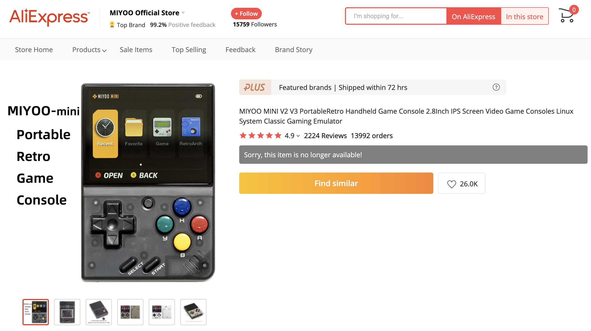

# Miyoo Mini Bot
This bot opens a Chrome window with the Aliexpress Miyoo Mini website and refreshes it every x seconds (0.5s by default) until there is stock available to buy it.


## Requirements
- Have Python 3.7+ install
- Have Google Chrome
- Have an Aliexpress account and a payment method setup (to make the buying process quicker).

## Instructions
- In the terminal:
```console
git clone https://github.com/Ed1123/Miyoo-Mini-Bot.git
cd Miyoo-Mini-Bot
pip install -r requirements.txt
python3 main.py
```

- Once the browser window is open you will have to **change the language to English** otherwise the scraper won't work. The changes will be saved for next runs.
- Optional: Log in and have a payment method already setup so the buying is quicker. The changes will be saved for next runs.

- Recommendation: To avoid potential IP banning don't abuse the scraper. Try to open it a couple of minutes (or seconds) prior to the know times there are potential restocks (don't know which those are? Check online. I'm not sure of them either.).
